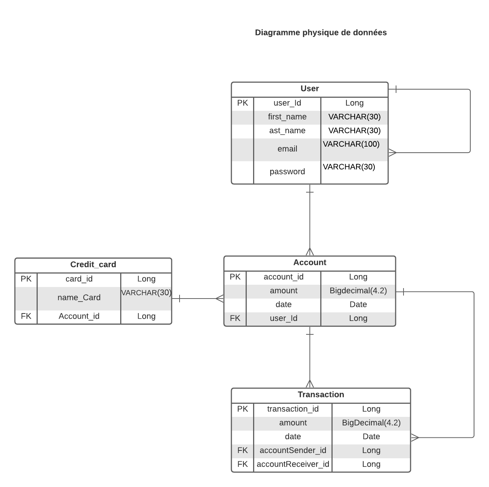

# PayMyBuddy - Readme File

Les fichiers BD:

- [ScriptCreation.sql](ScriptCreation.sql) contient le code de création des tables.
- [JeuxDonnees.sql](JeuxDonnees.sql) contient des exemples d'enregistrements pour les tables créées.